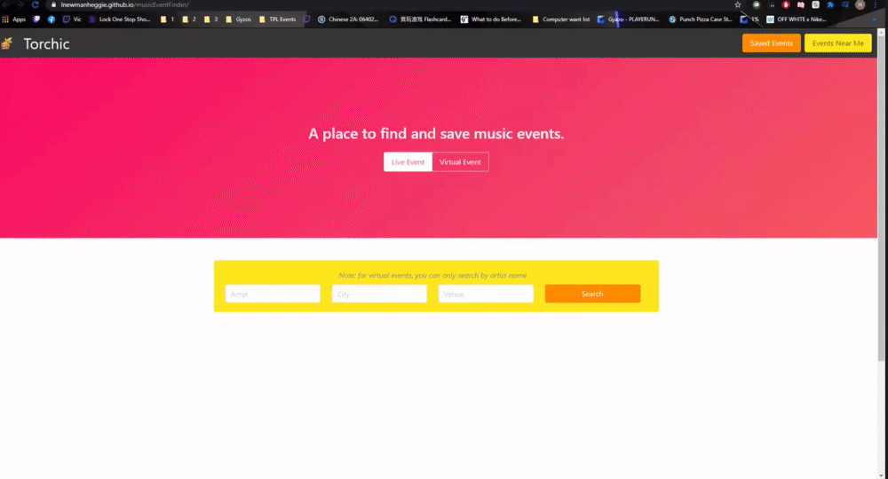

# Torchic
A website to find the music events through two different websites.
# Created: '2021 January 20'

[Deployed App](https://lnewmanheggie.github.io/musicEventFinder/)

[Repo](https://github.com/lnewmanheggie/musicEventFinder)

# Project Team:
 * [Elizabeth](https://github.com/ebe1997) 
 * [Sam](https://github.com/zylanthic) 
 * [Hayden](https://github.com/H-garr) 
 * [Lydia](https://github.com/lnewmanheggie) 
# API'S:
* [Ticket Master](https://developer.ticketmaster.com/products-and-docs/apis/getting-started/)
* [Bands In Town](https://app.swaggerhub.com/apis/Bandsintown/PublicAPI/3.0.0#/)
* [Reverse Geolocation](https://locationiq.com/sandbox/geocoding/reverse)

# Application Preview
To use this application check out the deployed link above.

**Live vs virtual toggler**: Allows users to specify whether they would like to search live events or virtual events.

**Search page**: Users can input an artist name and either a city or venue, or just an artist name, city name, or venue.
Results will show up based on search criteria. Users have the ability to save events by clicking on the save button. 

**Saved events page**: A user's saved events will pop up on this page. Users have the option to delete saved events. 

### Additional Features
**Events near me**: Allows users to get events based on their current location.

# Future Development
**One**: Create a feature to search by genre
**Two**: Embed the link to buy tickets directly in the search results

